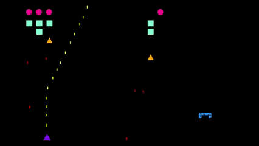
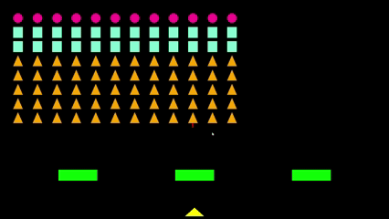

# Space Invaders POO

## 1. Identificação da Equipe

* **Sidnei Silva Gonçalves Júnior**
* **José Marcos Bittencourt Oliveira Prado**

## 2. Link para o Repositório

🔗 [Space-Invaders-POO (GitHub)](https://github.com/SidneiJunior21/Space-Invaders-POO)

---

## 3. Descrição do Tema do Trabalho

O tema escolhido foi o **remake do clássico jogo “Space Invaders”**, desenvolvido sob a óptica da **programação orientada a objetos (POO)**.

O objetivo foi recriar a dinâmica do jogo original utilizando os conceitos fundamentais da disciplina e explorando sua aplicação prática em duas linguagens distintas:

* **Java (com JavaFX)**
* **Python (com Pygame)**

---

## 4. Discussão do que foi Desenvolvido

### 🔹 Versão em Java

O jogo foi implementado com interface gráfica construída no **JavaFX**.

* Foram desenvolvidas **12 classes autorais**, organizadas em packages para maior clareza:

  * `app/` – contém a classe principal `App.java`
  * `core/` – encapsula o comportamento central do jogo
  * `entities/` – reúne as entidades (Player, Enemy, Projectile, etc.) e a classe abstrata `Entity`
  * `ui/` – concentra a lógica de interface gráfica

* O loop de jogo atualiza continuamente a interface e o estado dos objetos, enquanto os comandos do jogador são processados em tempo real.

* Principais conceitos aplicados:

  * **Encapsulamento:** separação clara entre interface e lógica
  * **Herança:** entidades compartilham atributos e comportamentos via `Entity`
  * **Polimorfismo:** diferentes entidades implementam comportamentos distintos
  * **Tratamento de exceções:** para lidar com entradas inválidas ou falhas sem quebrar o programa

No fim, obtivemos uma versão **funcional, simples e jogável** do Space Invaders.

---

### 🔹 Versão em Python

O processo de criação da versão em Python evoluiu de uma **tradução conceitual do projeto Java** para um **design orientado a objetos mais maduro**.

* Inicialmente, foi estabelecida uma base de herança por meio de uma classe **`Entity`**, da qual derivavam as principais entidades do jogo, como **SpaceShip** e **Enemy**.
* Conforme novas funcionalidades foram sendo incorporadas, grande parte da lógica ficou concentrada no script `main.py`, o que trouxe dificuldades de manutenção e evidenciou a necessidade de refatoração.
* O passo crucial foi a introdução da classe **`Game`**, que passou a **encapsular todo o estado e os ciclos de vida da aplicação** (menu, execução, pausa). Dessa forma, o `main.py` pôde ser reduzido a um **simples inicializador**.
* Em paralelo, os arquivos foram organizados em um pacote **`sprites/`**, no qual cada entidade ganhou seu próprio módulo, reforçando a modularidade.
* Todas as constantes do jogo foram extraídas para **`settings.py`**, centralizando configurações e promovendo reutilização.

---

## 5. Discussão da POO na Segunda Linguagem (Python)

Na versão em Python, a transição para POO foi **progressiva e estruturada**:

* **Herança:** a classe base `Entity` estabeleceu atributos e comportamentos comuns a todas as entidades.
* **Encapsulamento:** a classe `Game` passou a controlar exclusivamente os estados e fluxos do jogo.
* **Modularidade:** sprites foram divididos em módulos individuais dentro de `sprites/`, e configurações foram centralizadas em `settings.py`.
* **Abstração:** a lógica de controle do jogo foi isolada em classes e métodos especializados.

Essa transformação deixou claro como a POO melhora a **organização, clareza e manutenção** do código, tornando a aplicação mais próxima de um **projeto de software escalável** do que de um simples script.

---

## 6. Comparação entre as Versões Java e Python

| Aspecto                        | Versão em Java (JavaFX)                                                                | Versão em Python (Pygame)                                                                  |
| ------------------------------ | -------------------------------------------------------------------------------------- | ------------------------------------------------------------------------------------------ |
| **Paradigma inicial**          | Estrutura projetada desde o início em POO                                              | Começou como script funcional, evoluiu para POO                                            |
| **Classe base**                | `Entity` abstrata compartilhando atributos/métodos comuns                              | `Entity` como classe-mãe para SpaceShip, Enemy, Projectile etc.                            |
| **Organização de pacotes**     | `app/`, `core/`, `entities/`, `ui/`                                                    | `sprites/` (entidades separadas), `settings.py` (configurações), `game.py` (núcleo)        |
| **Controle do jogo**           | Loop principal controlado pelo JavaFX + classe de aplicação                            | Classe `Game` encapsula ciclo de vida, estados (menu, jogo, pausa) e regras                |
| **Encapsulamento**             | Separação clara entre lógica de jogo e interface gráfica                               | Separação progressiva: lógica central isolada em `Game` e sprites encapsulados             |
| **Herança e Polimorfismo**     | Uso de `Entity` abstrata e classes derivadas que implementam comportamentos diferentes | Herança direta de `Entity` + polimorfismo para diferenciar entidades                       |
| **Modularidade**               | Classes agrupadas em pacotes coerentes                                                 | Refatoração em módulos independentes (um arquivo por entidade), simplificação de `main.py` |
| **Abstração de configurações** | Não centralizada (distribuída entre classes)                                           | Centralização no arquivo `settings.py`, facilitando ajustes                                |
| **Resultado final**            | Versão funcional, simples e fiel ao Space Invaders                                     | Versão robusta, modular, fácil de manter e expandir                                        |

---

## 7. Como Rodar o Projeto

### 🔹 Requisitos

* **Java 24.0.1**
* **Maven** configurado
* **Python 3.x**
* Biblioteca **Pygame** (`pip install pygame`)

### 🔹 Rodando a versão Java

```bash
mvn clean javafx:run
```

### 🔹 Rodando a versão Python

```bash
python main.py
```

---

## 8. Screenshots

### Versão Java (JavaFX)



### Versão Python (Pygame)



---

## 9. Conceitos de POO aplicados

* **Encapsulamento:** classes controlam seus próprios atributos e métodos
* **Herança:** entidades derivam da abstração `Entity`
* **Polimorfismo:** métodos sobrepostos para diferentes comportamentos
* **Abstração:** classes genéricas para reduzir redundância e aumentar reutilização

---